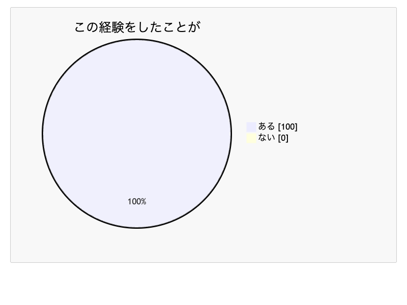
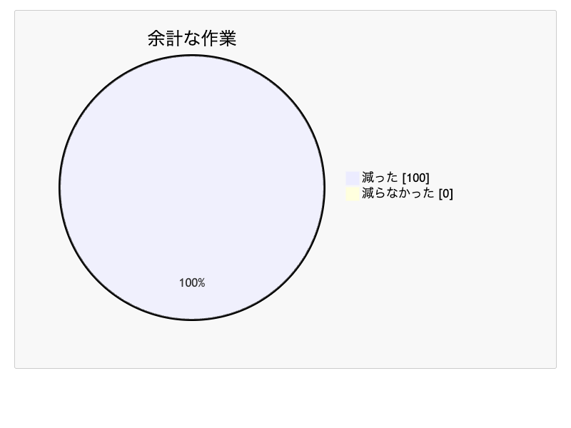
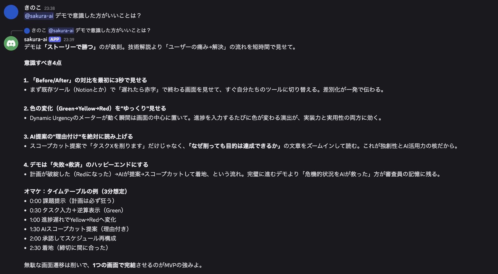
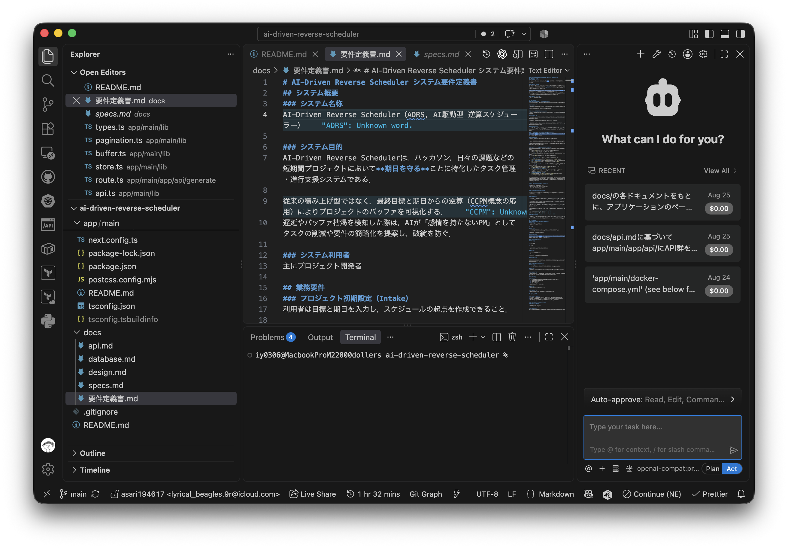
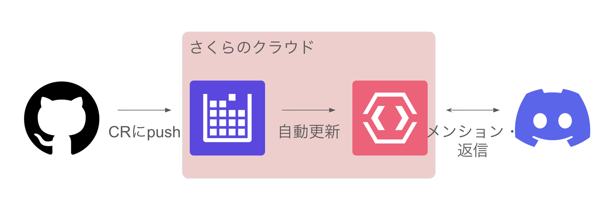

<!-- paginate: true -->
<!-- _class: lead -->

# どんな手を使っても絶対間に合わせるスケジューラ

チーム 留数和 

---
<!-- 課題設定力 -->
# 期限守るの苦手な人🙋‍♂️

---
<!-- 課題設定力 -->
# タスクに取り組んだら，余計な要素をふやして
# 戻れなくなったことあるって人🙋‍♂️

---
<!-- 課題設定力 -->
# そのまま戻れなくなること、よくありますよね

---
<!-- 課題設定力 -->
# 実際、多くの人がこの経験をしている

---
<!-- 課題設定力 -->
# 実際、多くの人がこの経験をしている

n=2, チームメンバーを対象

---
<!-- 課題設定力 -->
# じゃあどうする

---
<!-- 独創性/新規性・実用性 -->
# 機械にタスクを削ってもらう

---
# でもスケジューラはいくらでもある
<!-- 独創性/新規性 -->
- タスクの所要時間を足して計画するツールはもうある
- 警告するだけのツールならいくらでもある

---
<!-- 独創性/新規性 -->
# ところが，実際は

- 計画されたところで，苦手な人は守れない
  - 結局，中途半端にやって意味をなさないことも
- 警告されたところで，解決させられないことだってある
  - スケジューラが**具体的な**解決方法を提案してくれるわけではない

---

<!-- 独創性/新規性 -->
# 人間が作業内容のすべてを理解しているわけではない

- AIはだいたい作業者よりは知識はある
<!-- 独創性/新規性 -->
- 結局、作業を（だいたい）理解しているAIに，近道を作ってもらうのがベスト

<!-- ここにアプリのフローチャートを書く 入力する→出てくる みたいな -->

---
<!-- 実装力・AI活用力 -->
# デモンストレーション

<!-- このアプリの手順を書いてみる？ -->

---
<!-- 実用性 -->
<!-- _class: mermaid-slide -->
## 母集団の全員が「期限を間に合わせるのに役に立った」と回答

---
<!-- 実用性 -->
## 母集団の全員が「期限を間に合わせるのに役に立った」と回答

n=2, チームメンバーを対象

---
<!-- 実用性 -->
## AIで解決する
- AIを使って，タスクを理解させたうえでサブタスクに分割
- サブタスクの進行状況が悪ければ，AIが優先度の高いサブタスクの取捨選択を提案
-> 決断を提案することで，心理的ハードルの低下
-> タスクをまずまずの結果で終わらせられる可能性が上がる

---

<!-- 実装力 -->
## 技術スタック

- Next.js
  - API Routeを活用してモノリスに開発できたため
  - MVPの特性を考慮
- SQLite
  - DB起動はDocker composeのボトルネックになりやすく、DX(Developer experience)の観点から軽量なSQLiteを採用
  - 複雑なクエリを扱うことが想定できなかったこともある

---

<!-- 実装力 -->
## 開発で工夫した点

<!-- ここの情報量が少なすぎる -->

<!-- コミュニケーション -->
### Discordでわからないことを聞けるようにした

<!-- 口頭で自分が使った使い道を言うといいかも -->

---

### mdで仕様書-drivenにすることでAIが取り組みやすいようにした

ClineでAI Engineの`preview/Kimi2.7-Code`使いました (難易度の高いタスクではChatGPT-5.6 Solも利用)

---
## 諦めたこと
<!-- 実装力 -->

期間が短いことを考慮し、本筋から外れる機能拡張はしないようにした

<!-- 理由を書きたい -->
- レスポンシブ対応/ダークテーマ対応
- 特定のニーズ向けの機能
- ハッピーパスを抜けるもの
- CLI, ネイティブアプリなど別PFへの対応

---
## まとめ
<!-- もっとかけ -->

- 絶対に期限を守らせるスケジューラを作成した
- AI-drivenなコミュニケーションと開発をした
- ユーザーは満足してくれた

---

# 質疑応答

---

## 参考: Discordチャットボット

- GitHub: https://github.com/kloud-ryusuwa/discord-sakura-ai

<!-- sacloudの感想書きたい -->